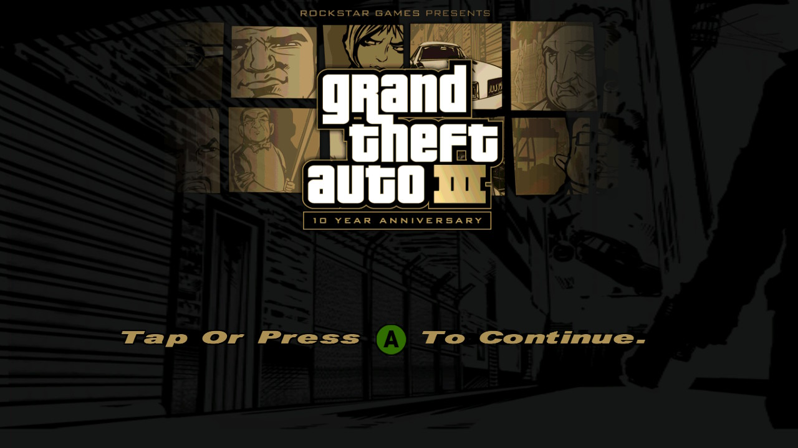
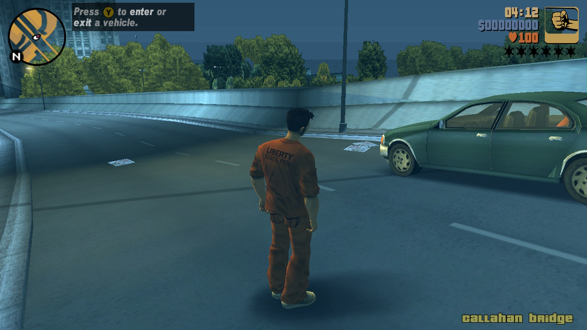

<div align="center">

# Grand Theft Auto III — Nintendo Switch

**A native Switch port of the Android build of GTA III.**


</div>

---

## Screenshots






---

## Why another GTA III port?

There is already an excellent GTA III reverse-engineering project — [re3](https://github.com/GTAmodding/re3) —
and it did have a Switch build. In practice that route is no easily usable:

1. **The Switch port repo was DMCA'd.** The upstream is gone.
2. **The `.nro` is hard to come by.** You have to dig through old forum threads or ask
   someone to share their copy.
3. **It expects PC assets.** GTA III was delisted from every storefront when the
   *"Definitive" Edition* shipped, so there is no legitimate way to buy the version it wants.

So the classic route asks you to find two things that are both not easily obtainable.

This port takes a different angle: it runs the **Android build**, which is still on sale
and still installable today.

Also — it was fun.

---

## How it works

This is **not** a recompilation. The original `libGame.so` — the actual ARM64 game binary
from the Android release — is loaded and executed as-is.

Rendering goes through Mesa's Nouveau driver on a GLES 3.2 context (the game asks for
GLES 2; the EGL wrappers upgrade it). Compressed textures (DXT) take the hardware path,
so no CPU decompression happens at runtime.

---

## What you need

* A Nintendo Switch running custom firmware (Atmosphère), with homebrew launching enabled
* Roughly **1.3 GB** free on the SD card
* An Android device with **Grand Theft Auto III** installed from the Play Store
* [SAI](https://play.google.com/store/apps/details?id=com.mtv.sai) or
  [Aurora Store](https://auroraoss.com/) to extract a backup of that install
* WinRAR / 7-Zip / any archive tool on your PC

> [!IMPORTANT]
> Assets and libraries are **not** distributed here and never will be. You extract them
> from a copy of the game you own. This repository is only the loader.

---

## Step 1 — Extract the assets and libraries

1. Install **Grand Theft Auto III** from the Play Store on your Android device.
2. Install **SAI** or **Aurora Store**.
3. Make a backup of the installed GTA III — you get an `.xapk` / `.apks` split-APK bundle.
4. Open the bundle with WinRAR (or 7-Zip). It contains several *split* parts.
5. From the **`data_main`** split, extract the whole **`assets/`** folder.
6. From the **`arm64_v8a`** split, extract **`libGame.so`** and **`libc++_shared.so`**
   (they live under `lib/arm64-v8a/`).

You want the **arm64-v8a** libraries specifically. The Switch is ARM64 — a 32-bit
`armeabi-v7a` `libGame.so` will not load.

## Step 2 — Copy everything to the SD card

Create `/switch/gta3/` on your SD card and lay it out exactly like this:

```
sdmc:/switch/gta3/
├── gta3.nro                      ← from Releases (or your own build)
├── gta3_nx.cfg                   ← created automatically on first launch
│
├── lib/
│   ├── libGame.so                ← from the arm64_v8a split   (~3.9 MB)
│   └── libc++_shared.so          ← from the arm64_v8a split   (~1.0 MB)
│
└── assets/                       ← from the data_main split  (~1.2 GB total)
    └── ...
```


`shadercache/` is created by the port on first run and holds Mesa's compiled shaders. Leave
it alone — deleting it just makes the next boot slower. Logs (`gta3_log.txt`) only appear
if you turn logging on.

## Step 3 — Launch

Open the homebrew menu and pick **Grand Theft Auto III**.

> [!NOTE]
> **The first boot is slow** — the port front-loads work at startup so that gameplay stays
> smooth afterwards. Give it a minute. Later launches are faster once the shader cache is warm.

---

## Controls

The face buttons keep the PlayStation layout the game was designed around, with A and B
swapped so the console's own convention survives — **A confirms, B backs out**:

| Switch | Original | In game |
| --- | --- | --- |
| **A** | ✕ Cross | accelerate, menu confirm |
| **B** | ○ Circle | fire, menu back |
| **Y** | ▢ Square | brake / reverse |
| **X** | △ Triangle | enter vehicle |

On-screen prompts name the button you actually press. The game's help icons are indexed
by the original button number, so the port rewrites that lookup to match the pad in your
hands rather than leaving every prompt one letter out.

Press **L3 + R3** to open the cheat entry keyboard, and **L + R + D-pad Down** to toggle
the performance overlay. Any face or shoulder button skips an intro movie.

---

## Configuration

`gta3_nx.cfg` sits next to the `.nro` and is written with defaults on first launch.

| Key | Default | Meaning |
| --- | --- | --- |
| `screen_width` | `-1` | `-1` = auto: **1920x1080** docked, **1280x720** handheld |
| `screen_height` | `-1` | as above |
| `trilinear_filter` | `1` | trilinear texture filtering |
| `fps_cap_30` | `1` | `1` = 30 FPS cap, `0` = uncapped to 60 |
| `streaming_budget_ms` | `5.0` | per-frame time budget for streaming work |
| `show_fps_overlay` | `0` | on-screen FPS / frame-time / freeze counter, plus resolution and dock state (top-left) |
| `intro_movies` | `1` | play the Rockstar logo and title movies at boot; `0` skips straight to the menu |
| `debug_log_enabled` | `0` | write `gta3_log.txt` to the SD card |
| `log_mask` | `0x...` | bitmask of log categories, only meaningful with logging on |

Set `show_fps_overlay=1` and `debug_log_enabled=1` if you are filing a performance issue.
Both are off by default because writing to the SD card every frame costs frames. The
overlay can also be summoned mid-game with **L + R + D-pad Down**, which does not need a
config edit or a relaunch (it is not remembered between launches).

---

## Building from source

You need [devkitPro](https://devkitpro.org/wiki/Getting_Started) with the Switch toolchain:

```bash
pacman -S switch-dev switch-mesa switch-libdrm_nouveau switch-openal-soft \
          switch-sdl2 switch-mpg123 switch-libexpat switch-libzstd switch-zlib \
          switch-ffmpeg
```


Then, **from PowerShell** (see the warning below):

```powershell
$env:DEVKITPRO="C:\devkitPro"; $env:PATH="C:\devkitPro\devkitA64\bin;$env:PATH"; make
```

That produces `gta3.nro` in the project root. Copy it to `sdmc:/switch/gta3/`.

> [!WARNING]
> On Windows, build from **PowerShell, not Git Bash**. devkitPro's MSYS runtime and Git
> Bash's MSYS runtime do not share environment variables, and the build fails in
> confusing, misleading ways.

`libSDL2` is linked but unused by this code — devkitPro's `libopenal.a` is built against
an SDL2 audio backend and pulls it in. To build against a newer Mesa than the portlib,
drop an install tree at `mesa-install/opt/devkitpro/portlibs/switch/` and the Makefile
picks it up automatically.

---


## Acknowledgments

* **[gtasa_nx](https://github.com/NaGaa95/gtasa_nx)** — the blueprint
  for the whole approach: loading an Android `.so` natively on the Switch. This port started
  as a study of theirs.
* **devkitPro** — the toolchain, libnx, and the Switch Mesa port.
* **Rockstar Games** — for Liberty City.

---

## Legal

This repository contains **no game code and no game assets**. `libGame.so`,
`libc++_shared.so` and everything under `assets/` are Rockstar Games' copyrighted
property and must come from your own legally purchased copy of the Android release.

The port code is MIT licensed. *Grand Theft Auto III* and *Rockstar Games* are trademarks
of Take-Two Interactive. This project is not affiliated with, endorsed by, or connected to
Rockstar Games or Take-Two Interactive in any way.
